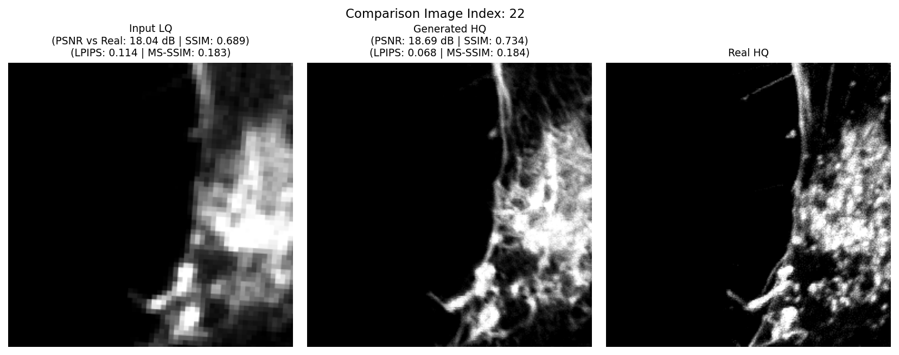
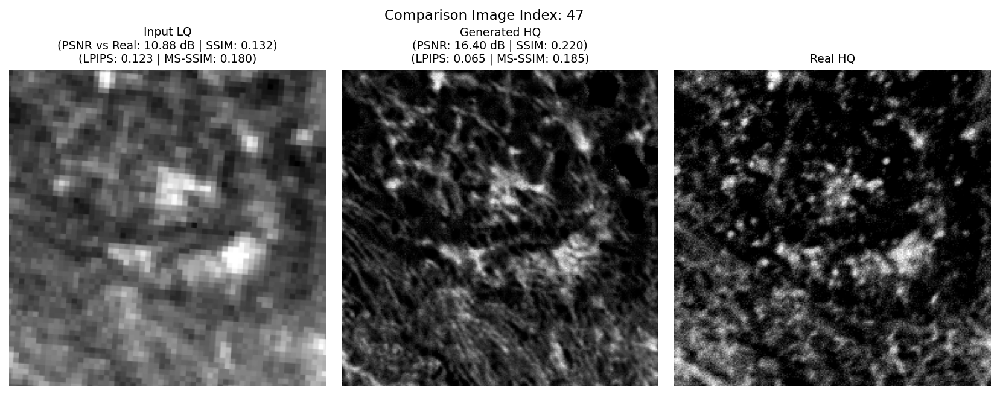

# 🔬 Confocal CycleGAN: Unpaired Image-to-Image Translation for Microscopy

<p align="center">
  
  
</p>


[](https://www.python.org/)
[](https://pytorch.org/)


This project implements a CycleGAN model for unpaired image-to-image translation, specifically tailored for confocal microscopy images. It allows transforming images from one microscopy domain to another without requiring paired training data.

## ✨ Features

*   **CycleGAN Architecture**: Employs the core CycleGAN framework for robust unpaired image translation.
*   **Configurable Networks**:
    *   **Generator**: Choose between different ResNet block configurations (e.g., `resnet_9blocks`, `resnet_6blocks`). Support for dropout.
    *   **Discriminator**: PatchGAN discriminator for effective adversarial training.
*   **Attention Mechanisms**: Enhance generator performance with integrated attention modules:
    *   CBAM (Convolutional Block Attention Module)
    *   SelfAttention
*   **Perceptual Loss**: Option to use VGG19 Perceptual Loss for improved image quality and feature matching.
*   **Flexible Loss Functions**:
    *   Adversarial Loss: LSGAN (Least Squares GAN) or Vanilla GAN.
    *   Cycle Consistency Loss.
    *   Identity Loss.
*   **Distributed Training**: Supports Distributed Data Parallel (DDP) for multi-GPU training.
*   **Mixed Precision Training**: AMP (Automatic Mixed Precision) for faster training and reduced memory usage.
*   **Detailed Logging & Visualization**:
    *   Comprehensive loss tracking (for epochs and batches).
    *   Automatic generation of loss plots.
    *   Saves sample images during training.
*   **Easy Configuration**: Centralized configuration management via `src/config.py`.
*   **Checkpointing**: Save and load model checkpoints for resuming training or evaluation.

## 🏗️ Arquitectura Visualizada

<p align="center">
  
</p>

## ⚙️ Configuration

All major settings, including paths, model architecture, hyperparameters, and training options, are managed in the `src/config.py` file. Before running the project, please review and customize this file according to your dataset and requirements.

Key configurable aspects:
*   Dataset paths (`DATA_DIR`, `TRAIN_DATA_PATH`, `VAL_DATA_PATH`)
*   Image properties (`IMG_HEIGHT`, `IMG_WIDTH`, `INPUT_CHANNELS`, `OUTPUT_CHANNELS`)
*   Model types (`GEN_TYPE`, `DISC_TYPE`) and parameters (`NGF`, `NDF`, `N_LAYERS_DISC`)
*   Attention mechanisms (`USE_ATTENTION`, `ATTENTION_TYPE`)
*   Loss weights (`LAMBDA_CYCLE`, `LAMBDA_IDENTITY`, `LAMBDA_VGG`)
*   Training parameters (`NUM_EPOCHS`, `BATCH_SIZE`, `LR_G`, `LR_D`)

## 🚀 Getting Started

### Prerequisites

*   Python 3.7+
*   PyTorch 1.7+
*   NumPy
*   Matplotlib
*   tqdm


It's recommended to set up a virtual environment:
```bash
python -m venv .venv
source .venv/bin/activate
pip install torch torchvision torchaudio numpy matplotlib tqdm
```

### Data Preparation

1.  Organize your confocal microscopy image data.
2.  Update the `TRAIN_DATA_PATH` and `VAL_DATA_PATH` in `src/config.py` to point to your training and validation `.npz` files (as suggested by `dataset.py`). Ensure your dataset format is compatible with `NpzImageDataset`.
3.  The project expects images to be normalized to the `[-1, 1]` range.

### Training

To start training the CycleGAN model:

```bash
python src/train.py
```

If you are using distributed training with multiple GPUs (e.g., 2 GPUs):
```bash
torchrun --nproc_per_node=2 src/train.py
```

*   Training progress, losses, and sample images will be saved to the `OUTPUT_DIR` specified in `config.py`.
*   Model checkpoints will be saved in the `CHECKPOINT_DIR`.

### Evaluation

To evaluate a trained model and generate translated images:

1.  Ensure your trained generator checkpoints (e.g., `latest_netG_A2B.pth`) are in the `CHECKPOINT_DIR`.
2.  Update `EVAL_CHECKPOINT_G_A2B` (and `EVAL_CHECKPOINT_G_B2A` if needed) in `src/config.py` with the desired checkpoint names.
3.  Prepare your evaluation dataset and update relevant paths if different from training.

Run the evaluation script:
```bash
python src/eval_3.py
```
Generated samples will be saved in `EVAL_SAMPLES_DIR`.

## 📁 Project Structure

\`\`\`
.
├── data/                       # (Create this directory) For your datasets
├── models/                     # Model definitions (generators, discriminators)
│   ├── __init__.py
│   └── networks.py
├── outputs/                    # (Created automatically) Output directory
│   ├── checkpoints/            # Saved model checkpoints
│   ├── samples_eval/           # Evaluation image samples
│   └── samples_train/          # Training image samples
├── resultados/                 # (Existing directory, purpose?)
├── src/                        # Source code
│   ├── __init__.py
│   ├── config.py               # Main configuration file
│   ├── dataset.py              # Dataset loading and preprocessing
│   ├── evaluate.py             # Evaluation script
│   ├── eval.py                 # (Alternative evaluation script)
│   ├── eval_2.py               # (Alternative evaluation script)
│   ├── eval_3.py               # (Alternative evaluation script)
│   ├── plot_losses.py          # Script to plot loss curves
│   ├── train.py                # Main training script
│   ├── train_r.py              # Train recovery
│   ├── utils.py                # Utility functions (schedulers, saving, etc.)
│   └── vgg_loss.py             # VGG perceptual loss implementation
├── .gitattributes
├── README.md                   # This file
└── ... (other project files)
\`\`\`

## 🤝 Contributing

Contributions are welcome! If you'd like to contribute, please follow these steps:
1. Fork the repository.
2. Create a new branch (`git checkout -b feature/your-feature-name`).
3. Make your changes.
4. Commit your changes (`git commit -m 'Add some feature'`).
5. Push to the branch (`git push origin feature/your-feature-name`).
6. Open a Pull Request.
